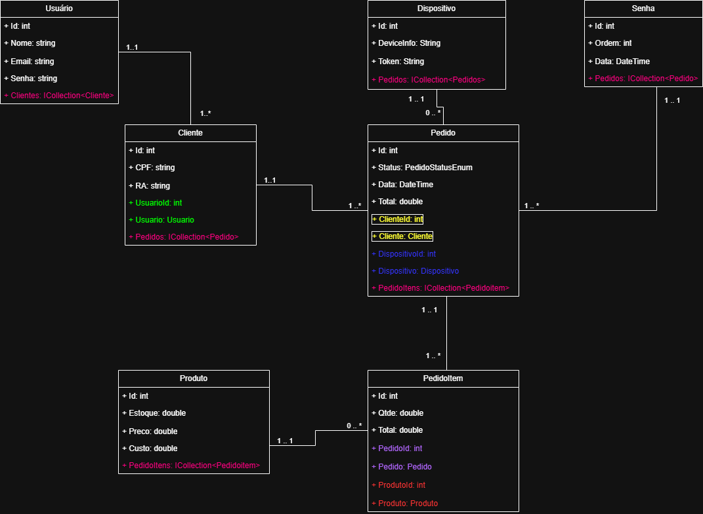

# ReFeitep - Gestão de Refeitório da UniFeitep

Este repositório armazena o código fonte da API responsável pelo controle do refeitório da UniFeitep Maringá. O projeto está sendo desenvolvido pelos alunos do Curso Superior em Tecnologia para Análise e Desenvolvimento de Sistemas, turma ADSN5S, do período noturno.

## Objetivos do projeto

- Desenvolver uma API responsável pelo gerenciamento das informações do app ReFeitep;
- Permitir que alunos e demais membros da IES possam adquirir produtos da cantina via smartphone, sem a necessidade de acessar filas;
- Automatizar o atendimento, controlando os pedidos por senha;
- Permitir a aquisição antecipada de produtos antes do horário de intervalo;
- Gerenciar as operações financeiras da cantina.

## Tecnologias utilizadas

A API do ReFeitep está sendo desenvolvida com as seguintes tecnologias:

- Framework dotnet 8.0
- ORM Entity Framework Core
- Linguagem de programação C#
- Projeto Web API
- Banco de Dados MySQL
- Swagger Doc

## Design Patterns e Project Patterns utilizados

Por ser um projeto orientado a objetos, serão utilizados os seguintes padrões:

- MVCS (Model-View-Controller-Service)
- API Restful
- Entity Framework Fluent Api

## Diageama de Classes da API

O Diagrama de Classes da API foi desenvolvido pelo professor e orientador do projeto Alex Rocha. Também é possível acessar o diagrama através [deste link](https://viewer.diagrams.net/?tags=%7B%7D&lightbox=1&highlight=0000ff&edit=_blank&layers=1&nav=1&title=refeitep_class_diagram&dark=auto#Uhttps%3A%2F%2Fdrive.google.com%2Fuc%3Fid%3D1CFoNRN8hVCWrQ-hT2FW8-jXgPcbSlIEQ%26export%3Ddownload).

## Rotas da API

As Rotas da API foram definidas pelo então professor e orientador Alex Rocha, e pode ser acessada clicando [neste link](./docs/ROTAS.md).